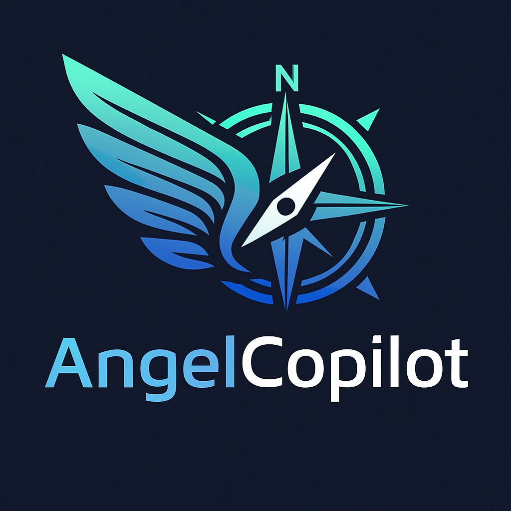

# Angel Copilot Skill for AI Agent Tools

Angel Copilot is a skill for AI agent tools (e.g., Claude Code, Codex, etc.) that helps users build an investor profile, plan allocations, and assess startup deals using a structured rubric and web-sweep process.

## Use in the Claude UI (upload)

Upload the packaged `angel-copilot.skill` file from the repo root.

## Use in Claude Code (local skill)

1) Clone this repo.
2) In Claude Code, add a local skill and point it to:

```
skills/public/angel-copilot
```

If your Claude Code setup expects skills to live in a specific directory, you can also copy the folder there.

## Use in Codex (local skill)

Copy the skill folder to your Codex skills directory, typically:

```
~/.codex/skills/angel-copilot
```

## Use

Example prompts:
- Create or load my investor profile
- Start onboarding
- Suggest my investment allocation
- Upload a startup's documents or information and ask "Assess a startup deal".
- Generate a due diligence checklist
- Explain what a SAFE is and how it differs from a convertible note

## Use the packaged .skill file

This repo already includes `angel-copilot.skill`.

## Further reading

- How to use AngelCopilot: https://beyondthedemoai.substack.com/p/angelcopilot-a-copilot-for-angel
- How AngelCopilot was built: https://www.linkedin.com/pulse/how-i-built-angelcopilot-turning-custom-gpt-system-chouliaras-eqwoe/?trackingId=DViRC4F3QcaGwJSxjGoZAA%3D%3D
