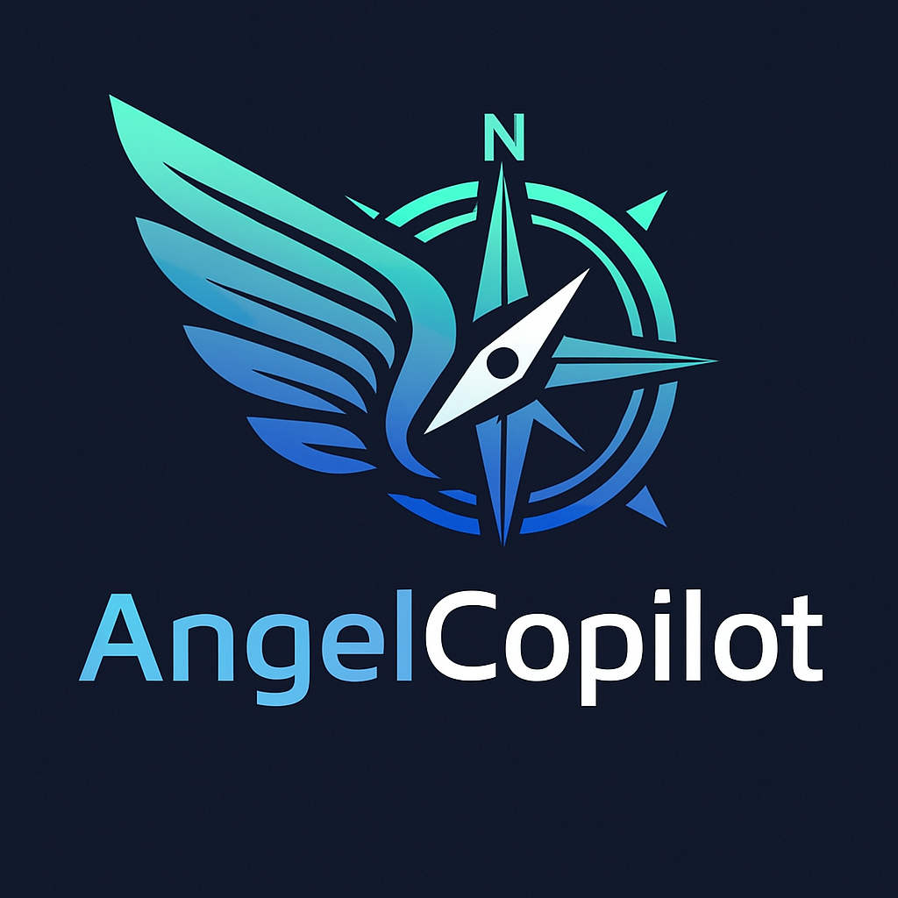

# Angel Copilot Skill for AI Agent Tools

Angel Copilot is a skill for AI agent tools (e.g., Claude Code, Codex, etc.) that helps users build an investor profile, plan allocations, and assess startup deals using a structured rubric and web-sweep process.

This repository now includes two usage modes:
- Lite mode: skill-only, conversational/manual assessments.
- Batch mode: local Python CLI for weekly multi-deal processing (`md/csv/json/pdf` outputs).

## Use in the Claude UI (upload)

Upload the packaged `angel-copilot.skill` file from the repo root.

## Use in Claude Code (local skill)

1) Clone this repo.
2) In Claude Code, add a local skill and point it to:

```
skills/public/angel-copilot
```

If your Claude Code setup expects skills to live in a specific directory, you can also copy the folder there.

## Use in Codex (local skill)

Copy the skill folder to your Codex skills directory, typically:

```
~/.codex/skills/angel-copilot
```

## Batch mode (local CLI)

### Install

```bash
python3 -m pip install -e .
```

Or with requirements files:

```bash
python3 -m pip install -r requirements.txt
python3 -m pip install -e .
```

Then run one setup command for PDF support:

```bash
angelcopilot setup
```

If `angelcopilot` is not found in your shell, run:

```bash
python3 -m angelcopilot_batch.cli setup
```

Or run directly from the repo without installing the CLI entrypoint:

```bash
PYTHONPATH=src python3 -m angelcopilot_batch.cli setup
```

### Optional local profile

Create a local investor profile file in the repo at:

`.angelcopilot/profile.md`

Batch mode reads this file by default via `--profile .angelcopilot/profile.md`.

You can create it in two ways.

1) Use the AngelCopilot skill onboarding flow
- In Codex/Claude with the skill loaded, run:
  - `Create or load my investor profile`
  - `Start onboarding`
- Answer the questions.
- Ask:
  - `Save my profile`
- Copy the returned profile block into `.angelcopilot/profile.md`.

2) Create it manually
- Copy the template:

```bash
mkdir -p .angelcopilot
cp examples/profile.local.template.md .angelcopilot/profile.md
```

- Then edit `.angelcopilot/profile.md` with your values.

Minimal example:

```text
region: Greece
currency: EUR
inferred_risk_level: High
ticket_typical: 25000
sectors_themes: AI, DevTools, B2B SaaS
geo_focus: Europe, US
```

Template file: `examples/profile.local.template.md`

Also accepted for convenience:
- `themes:` as an alias for `sectors_themes:`
- separators `,` `/` `&` `;` for list fields like sectors and geographies

### Validate weekly intake folder

```bash
angelcopilot batch validate --deals-root /path/to/deals --since-days 7
```

### Run weekly batch assessment

```bash
angelcopilot batch run \
  --deals-root /path/to/deals \
  --since-days 7 \
  --assistant codex \
  --profile .angelcopilot/profile.md \
  --out outputs
```

You can switch to Claude CLI with `--assistant claude`.

### Rebuild report artifacts for an existing run

```bash
angelcopilot batch report --run-id run_YYYY_Month_DD_HH-MM-SS_<TZ> --out outputs --formats md,csv,json,pdf
```

To write rerendered outputs into a new run folder name:

```bash
angelcopilot batch report --run-id OLD_RUN_ID --target-run-id NEW_HUMAN_READABLE_RUN_ID --out outputs
```

If you changed profile parsing/scoring logic and want old runs refreshed without rerunning assessments:

```bash
angelcopilot batch report \
  --run-id run_YYYY_Month_DD_HH-MM-SS_<TZ> \
  --out outputs \
  --recompute-scoring \
  --profile .angelcopilot/profile.md
```

Default run folder format is human-readable, for example:

`run_2026_March_21_12-33-45_CET`

Each run produces:
- `angelcopilot_batch_report.md`
- `angelcopilot_batch_summary.csv`
- `angelcopilot_batch_assessments.json`
- `angelcopilot_batch_report.html`
- `angelcopilot_batch_report.pdf` (if PDF dependencies are installed)

### Notes
- Batch mode expects one folder per deal and autodetects `txt/md/pdf/docx/zip`.
- `.zip` files are unzipped and parsed automatically during processing.
- Profile is local to the repo by default (`.angelcopilot/profile.md`) and excluded from git.
- Upstream document capture from AngelList remains manual/official.
- No scraping automation is included.

## Testing without production docs

This repo includes synthetic fixture deals under:

`tests/fixtures/deals`

Use them for local development and regression testing:

```bash
pytest -q
```

The fixture dataset includes:
- Plain `txt/md` deal docs.
- A zip-only deal input (`docs_bundle.zip`) to verify auto-unzip behavior.
- No real deal data.

## Use

Example prompts:
- Create or load my investor profile
- Start onboarding
- Suggest my investment allocation
- Upload a startup's documents or information and ask "Assess a startup deal".
- Generate a due diligence checklist
- Explain what a SAFE is and how it differs from a convertible note

## Use the packaged .skill file

This repo already includes `angel-copilot.skill`.

## Further reading

- How to use AngelCopilot: https://beyondthedemoai.substack.com/p/angelcopilot-a-copilot-for-angel
- How AngelCopilot was built: https://www.linkedin.com/pulse/how-i-built-angelcopilot-turning-custom-gpt-system-chouliaras-eqwoe/?trackingId=DViRC4F3QcaGwJSxjGoZAA%3D%3D
