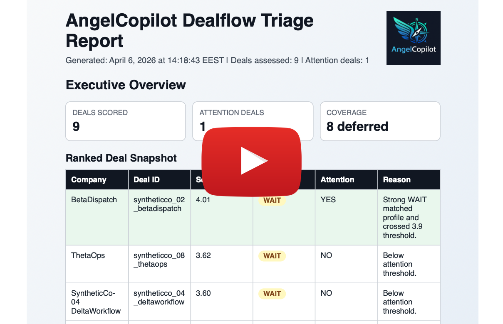
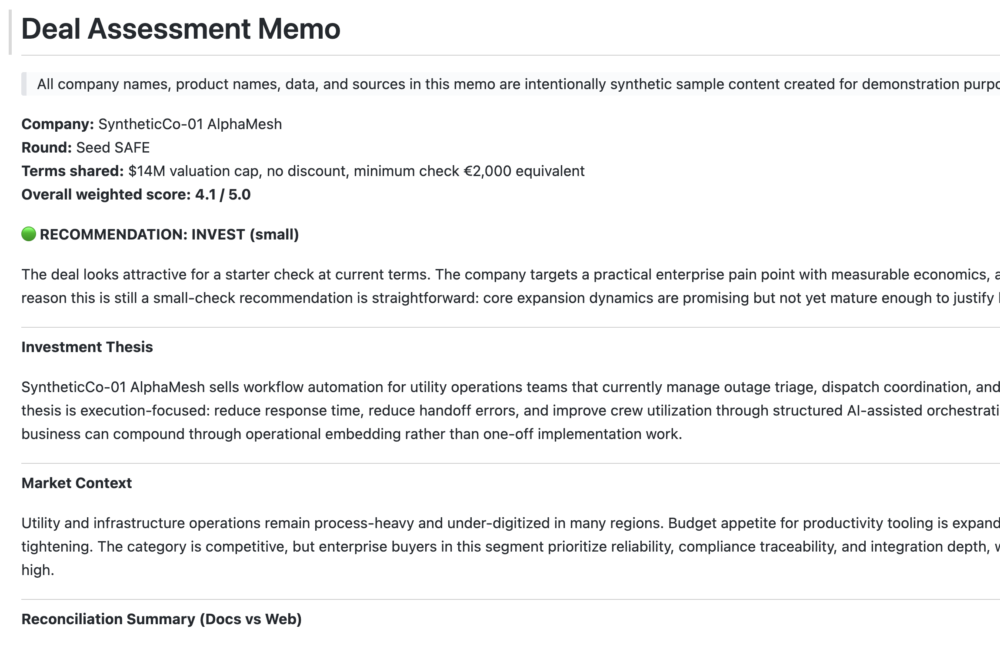
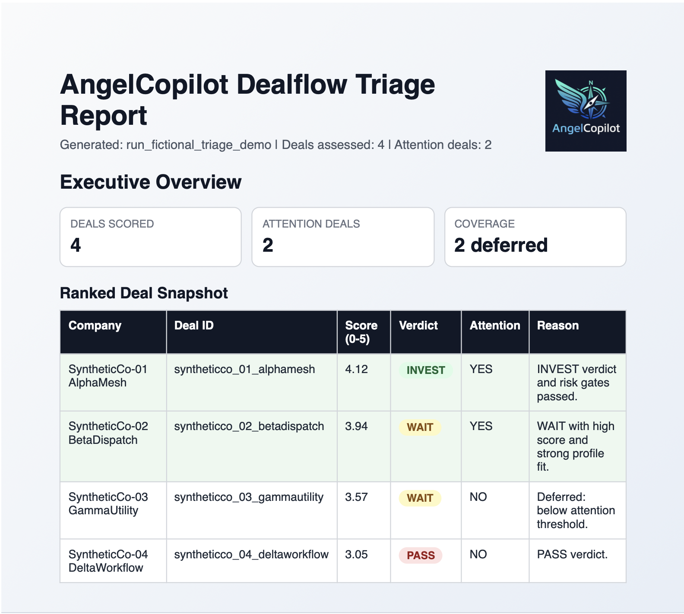
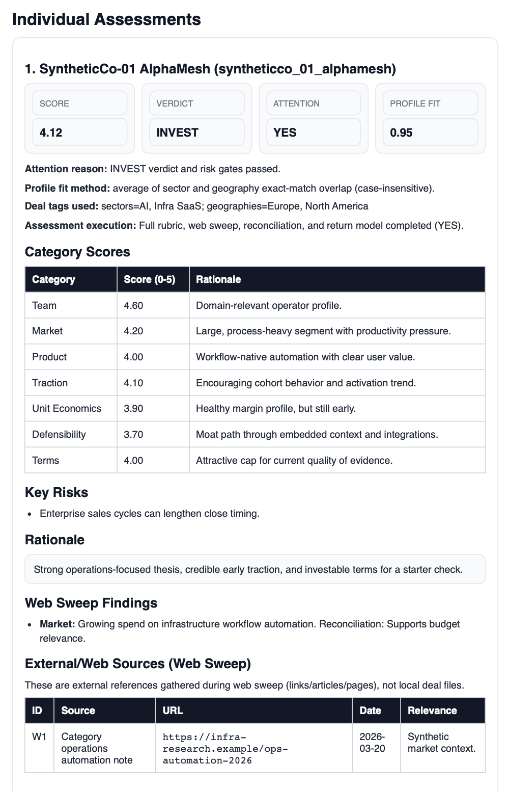

# Angel Copilot

Angel Copilot helps angel investors turn startup materials into a clear investment memo or a ranked dealflow report. Give it a deck, a one-pager, diligence notes, or a folder of opportunities, and it helps you get to a sharper first view faster.

Angel Copilot is available in three ways:

- Fastest path: as a [Custom GPT](https://chatgpt.com/g/g-69011b259dd88191860f2327c0cf19c7-angelcopilot)
- Single-deal workflow: as an imported `angel-copilot.skill`
- Batch workflow: as an open-source local CLI that produces markdown, HTML, CSV, JSON, and PDF outputs

## Start here

- If you want the quickest way to try it, start with the [AngelCopilot GPT](https://chatgpt.com/g/g-69011b259dd88191860f2327c0cf19c7-angelcopilot).
- If you want to use the open-source repo locally, see [Local setup and workflows](docs/local-setup.md).
- If you are new to the product, start with the single-deal memo workflow before moving to batch triage.

## Who it is for

- Angel investors who want a more consistent way to review startup opportunities
- Solo fund managers, scouts, and syndicate leads handling a high volume of inbound deals
- Newer angel investors who want a disciplined memo process instead of ad-hoc note taking

## What Angel Copilot does

### 1) Deal Assessment Memo

Best for evaluating one startup at a time.

- Produces a written memo with scoring, key risks, return assumptions, and follow-up questions
- Works with or without an investor profile
- Useful for first-pass review, partner discussion, or investment notes

### 2) Dealflow Triage

Best for screening multiple startups and deciding where to spend time.

- Compares deals in a consistent format
- Ranks which opportunities deserve follow-up attention first
- Produces a comparative report you can review or share

### 3) Investor profile

Angel Copilot can use an optional investor profile so outputs reflect your geography, check size, stage preference, risk tolerance, and follow-on strategy.

## Demo

All screenshots and sample outputs below use synthetic example content from this repo.

### 30-second Dealflow Triage demo

### Deal Assessment Memo preview

### Dealflow Triage preview

## Quick start

### Fastest path: Custom GPT

1. Open the [AngelCopilot GPT](https://chatgpt.com/g/g-69011b259dd88191860f2327c0cf19c7-angelcopilot).
2. Use only materials you are comfortable sharing under your provider settings and your own confidentiality obligations.
3. Ask it to assess one deal or help you prioritize a batch of opportunities.

Example prompts:

- `Assess this startup deal`
- `What are the main risks in this deal?`
- `Help me prioritize which of these deals deserve attention`

### Open-source path: local skill or CLI

- For single-deal work, import `angel-copilot.skill` into a skill-enabled assistant.
- For batch triage, run the local CLI and generate comparative reports from your deal folders.
- Full setup instructions, sample commands, and profile guidance are in [Local setup and workflows](docs/local-setup.md).

Useful starting points:

- [Sample deal input](examples/sample-deal/README.md)
- [Sample outputs](examples/sample-output/README.md)

## Sample outputs

### Sample Deal Assessment Memo

- [Sample memo](examples/sample-output/quick-deal-memo/sample_quick_deal_memo.md)
- [Memo screenshot](docs/assets/single_deal_md_example.png)

### Sample Dealflow Triage Report

- [Sample report overview](examples/sample-output/dealflow-triage/README.md)
- [Sample PDF report](examples/sample-output/dealflow-triage/angelcopilot_batch_report.pdf)
- [Sample batch summary CSV](examples/sample-output/dealflow-triage/angelcopilot_batch_summary.csv)
- [Sample batch JSON](examples/sample-output/dealflow-triage/fictional_batch_assessments.json)

## Data handling

- You are responsible for the materials you upload and the assistant or provider settings under which they are processed.
- Before uploading real deal materials, review your provider's data controls, retention settings, and training settings, and make sure they match your requirements.
- This project is decision support only and is not legal, tax, or investment advice.

## Open-source repo

The repository includes:

- Skill content in `skills/public/angel-copilot/`
- A local batch CLI in `src/angelcopilot_batch/`
- Sample inputs, outputs, and screenshots for evaluation

For technical setup and local workflows, see [Local setup and workflows](docs/local-setup.md). For code contributions, see [CONTRIBUTING.md](CONTRIBUTING.md). For a quick map of the repo, see [docs/repository_structure.md](docs/repository_structure.md).

## Further reading

- [User guide](https://beyondthedemoai.substack.com/p/angelcopilot-a-copilot-for-angel)
- [Build story and evaluation](https://www.linkedin.com/pulse/how-i-built-angelcopilot-turning-custom-gpt-system-chouliaras-eqwoe/?trackingId=DViRC4F3QcaGwJSxjGoZAA%3D%3D)
